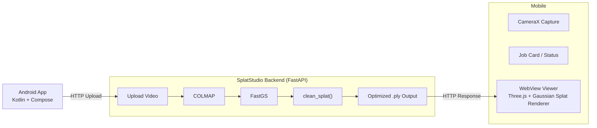

# SplatStudioApp

Android app for capturing a scene and viewing it back as a 3D Gaussian Splat.
This is the client-side counterpart to the
[SplatStudio](https://github.com/adityandandia/SplatStudio) backend
pipeline.


---

## Table of Contents

- [Gist](#gist)
- [Screenshots](#screenshots)
- [Architecture](#architecture)
- [Installation](#installation)
- [Configuration](#configuration)
- [Features](#features)
- [How to Record a Good Capture](#how-to-record-a-good-capture)
- [Troubleshooting](#troubleshooting)
- [Device Requirements](#device-requirements)
- [Privacy & Local Servers](#privacy--local-servers)

---

## Gist

Point your phone at something, record a short walk-around video, and send it
off for reconstruction. SplatStudioApp handles the capture (via CameraX), talks
to SplatStudio backend to turn that video into a 3D Gaussian Splat, and
then renders the result back on-device — right inside the app, no separate
viewer needed.

```
Record video → Upload to backend → Backend reconstructs → Download .ply → View in-app
```

The in-app viewer runs inside a WebView, using Three.js with a custom
`GaussianSplatRenderer` ShaderMaterial to render the splat.

---

## Screenshots

<p align="center">
  
  
  

</p>

---

## Architecture




- **Capture:** CameraX records a walk-around video on-device.
- **Upload:** video is sent to a SplatStudio backend instance over HTTP.
- **Reconstruction:** backend runs COLMAP for Structure-from-Motion, then
  FastGS for Gaussian Splat training, then a custom `clean_splat()` cleanup
  pass.
- **Delivery:** finished `.ply` is downloaded to the device and rendered
  in-app via a WebView + Three.js `GaussianSplatRenderer` ShaderMaterial.

---

## Installation

### Prerequisites

- A physical Android device (see [Device Requirements](#device-requirements)) —
  splat rendering and camera capture both need a real device.
- A running instance of the
  [SplatStudio](https://github.com/adityandandia/SplatStudio) backend,
  reachable from your device.

### Install

Download the latest APK from the [Releases](https://github.com/adityandandia/SplatStudioApp/releases)
page and install it on your device.

---

## Configuration

The app needs the address of a running SplatStudio instance. Set this in
the app's settings screen (or via `.env` / build config, depending on how
it's wired in your build):

```
http://<backend-machine-ip>:8000
```

If the backend is running on the same Wi-Fi network as your phone, use its
LAN IP.

> ⚠️ Read [Privacy & Local Servers](#privacy--local-servers) before pointing
> this at anything other than a machine you control.

Keep any API keys (e.g. `GEMINI_API_KEY`) in a local `.env` file — never
commit it. `.gitignore` already excludes `.env`; keep it that way.

---

## Features

| Feature | Description |
|---|---|
| CameraX-based capture | Record a walk-around video of an object or scene directly in-app. |
| Job tracking | A job card view shows upload/processing status for each capture sent to the backend. |
| In-app 3D splat viewer | View the reconstructed Gaussian Splat directly in the app via a WebView + Three.js renderer — no export needed. |
| Custom Gaussian Splat shader | Rendering uses a custom `GaussianSplatRenderer` ShaderMaterial rather than a generic point-cloud renderer, for proper splat blending. |
| Configurable backend endpoint | Point the app at any SplatStudio instance you're running, local or remote. |

---

## How to Record a Good Capture

For a clean reconstruction, capture technique matters more than almost
anything else in the pipeline:

1. Open the capture screen and frame the object or scene you want
   reconstructed.
2. Move slowly and steadily around the subject in an arc — smooth,
   continuous camera motion rather than quick pans or jumps.
3. Cover the subject from multiple angles (front, sides, and above if
   relevant) so the backend's Structure-from-Motion stage has enough overlap
   between frames to recover accurate camera poses.
4. Keep the background as static and uncluttered as possible — moving
   objects or busy backgrounds are a leading cause of splat artifacts on the
   backend side.
5. Avoid extreme lighting changes mid-recording (e.g. walking from bright
   sun into shade) — inconsistent lighting makes pose estimation harder.
6. Stop recording, then submit the job from the job card screen. Track its
   status until the reconstructed splat is ready to view.

---

## Troubleshooting

| Symptom | Likely cause | Notes |
|---|---|---|
| Streaky / comet-tail artifacts in the splat | Background contamination or COLMAP pose failure | Verify raw `.ply` renders cleanly in SuperSplat first — if it looks correct there, the issue is upstream of the viewer. |
| Splat geometry looks rotated/sheared | Quaternion→rotation-matrix bug producing a transposed matrix | Check the GLSL conversion in `GaussianSplatRenderer` for a transpose error. |
| Splat fails to load / garbled | PLY header or stride mismatch | Usually traced to the `clean_splat()` post-processing step on the backend. |
| Download triggers Android's native download dialog instead of loading in-WebView | WebView intercepting the binary response | Workaround: download natively in Kotlin, then inject via `evaluateJavascript` with Base64. |
| `404` on backend routes | Router missing a prefix, or a duplicate/orphan FastAPI app instance | Confirm only one `FastAPI()` instance is registered and routes are mounted under the expected prefix. |

---

## Device Requirements

- Android device with **ARCore support** (required for stable, tracked
  camera capture during recording) — check your device against Google's
  [ARCore supported devices list](https://developers.google.com/ar/devices).
- Android 8.0 (API 26) or higher.
- Rear camera capable of 1080p video capture.
- A GPU capable of rendering WebGL content smoothly — splat rendering is
  GPU-intensive, so low-end or older devices may show dropped frames or
  stutter in the viewer.
- At least a few hundred MB of free storage per capture (raw video +
  downloaded `.ply` output).
- Wi-Fi connectivity to reach your SplatStudio backend (see
  [Configuration](#configuration)).

---

## Privacy & Local Servers

SplatStudioApp talks to a SplatStudio backend over plain HTTP by default,
which has a few implications worth being deliberate about:

- **Your captured video leaves the device.** Anything you record is
  uploaded in full to whatever backend address is configured — treat that
  backend as trusted before recording anything sensitive.
- **Local/LAN backends are not encrypted by default.** If you're running
  SplatStudio on a machine on your local network and pointing the app at
  its LAN IP over plain `http://`, traffic (including the uploaded video and
  the resulting `.ply`) is not encrypted in transit. Don't do this over a
  network you don't trust (e.g. public Wi-Fi).
- **The backend has no auth by default.** Unless you've added
  authentication to your SplatStudio deployment, anyone who can reach its
  address can upload jobs or download outputs. If you expose it beyond your
  local network (port forwarding, a tunnel, a cloud VM with a public IP),
  add authentication first.
- **Uploaded videos and outputs persist on the backend.** SplatStudio
  writes incoming videos to `uploads/` and finished splats to `outputs/` on
  the backend machine and doesn't delete them automatically — clean these up
  yourself if you don't want captures to persist indefinitely.
- **`.env` / API keys stay local.** The `GEMINI_API_KEY` in your `.env` file
  is read locally by the app build and should never be committed to the
  repo.- **Upload:** video is sent to a SplatStudio backend instance over HTTP.
- **Reconstruction:** backend runs COLMAP for Structure-from-Motion, then
  FastGS for Gaussian Splat training, then a custom `clean_splat()` cleanup
  pass.
- **Delivery:** finished `.ply` is downloaded to the device and rendered
  in-app via a WebView + Three.js `GaussianSplatRenderer` ShaderMaterial.

---

## Installation

### Prerequisites

- A physical Android device (see [Device Requirements](#device-requirements)) —
  splat rendering and camera capture both need a real device.
- A running instance of the
  [SplatStudio](https://github.com/adityandandia/SplatStudio) backend,
  reachable from your device.

### Install

Download the latest APK from the [Releases](https://github.com/adityandandia/SplatStudioApp/releases)
page and install it on your device.

---

## Configuration

The app needs the address of a running SplatStudio instance. Set this in
the app's settings screen (or via `.env` / build config, depending on how
it's wired in your build):

```
http://<backend-machine-ip>:8000
```

If the backend is running on the same Wi-Fi network as your phone, use its
LAN IP.

> ⚠️ Read [Privacy & Local Servers](#privacy--local-servers) before pointing
> this at anything other than a machine you control.

Keep any API keys (e.g. `GEMINI_API_KEY`) in a local `.env` file — never
commit it. `.gitignore` already excludes `.env`; keep it that way.

---

## Features

| Feature | Description |
|---|---|
| CameraX-based capture | Record a walk-around video of an object or scene directly in-app. |
| Job tracking | A job card view shows upload/processing status for each capture sent to the backend. |
| In-app 3D splat viewer | View the reconstructed Gaussian Splat directly in the app via a WebView + Three.js renderer — no export needed. |
| Custom Gaussian Splat shader | Rendering uses a custom `GaussianSplatRenderer` ShaderMaterial rather than a generic point-cloud renderer, for proper splat blending. |
| Configurable backend endpoint | Point the app at any SplatStudio instance you're running, local or remote. |

---

## How to Record a Good Capture

For a clean reconstruction, capture technique matters more than almost
anything else in the pipeline:

1. Open the capture screen and frame the object or scene you want
   reconstructed.
2. Move slowly and steadily around the subject in an arc — smooth,
   continuous camera motion rather than quick pans or jumps.
3. Cover the subject from multiple angles (front, sides, and above if
   relevant) so the backend's Structure-from-Motion stage has enough overlap
   between frames to recover accurate camera poses.
4. Keep the background as static and uncluttered as possible — moving
   objects or busy backgrounds are a leading cause of splat artifacts on the
   backend side.
5. Avoid extreme lighting changes mid-recording (e.g. walking from bright
   sun into shade) — inconsistent lighting makes pose estimation harder.
6. Stop recording, then submit the job from the job card screen. Track its
   status until the reconstructed splat is ready to view.

---

## Troubleshooting

| Symptom | Likely cause | Notes |
|---|---|---|
| Streaky / comet-tail artifacts in the splat | Background contamination or COLMAP pose failure | Verify raw `.ply` renders cleanly in SuperSplat first — if it looks correct there, the issue is upstream of the viewer. |
| Splat geometry looks rotated/sheared | Quaternion→rotation-matrix bug producing a transposed matrix | Check the GLSL conversion in `GaussianSplatRenderer` for a transpose error. |
| Splat fails to load / garbled | PLY header or stride mismatch | Usually traced to the `clean_splat()` post-processing step on the backend. |
| Download triggers Android's native download dialog instead of loading in-WebView | WebView intercepting the binary response | Workaround: download natively in Kotlin, then inject via `evaluateJavascript` with Base64. |
| `404` on backend routes | Router missing a prefix, or a duplicate/orphan FastAPI app instance | Confirm only one `FastAPI()` instance is registered and routes are mounted under the expected prefix. |

---

## Device Requirements

- Android device with **ARCore support** (required for stable, tracked
  camera capture during recording) — check your device against Google's
  [ARCore supported devices list](https://developers.google.com/ar/devices).
- Android 8.0 (API 26) or higher.
- Rear camera capable of 1080p video capture.
- A GPU capable of rendering WebGL content smoothly — splat rendering is
  GPU-intensive, so low-end or older devices may show dropped frames or
  stutter in the viewer.
- At least a few hundred MB of free storage per capture (raw video +
  downloaded `.ply` output).
- Wi-Fi connectivity to reach your SplatStudio backend (see
  [Configuration](#configuration)).

---

## Privacy & Local Servers

SplatStudioApp talks to a SplatStudio backend over plain HTTP by default,
which has a few implications worth being deliberate about:

- **Your captured video leaves the device.** Anything you record is
  uploaded in full to whatever backend address is configured — treat that
  backend as trusted before recording anything sensitive.
- **Local/LAN backends are not encrypted by default.** If you're running
  SplatStudio on a machine on your local network and pointing the app at
  its LAN IP over plain `http://`, traffic (including the uploaded video and
  the resulting `.ply`) is not encrypted in transit. Don't do this over a
  network you don't trust (e.g. public Wi-Fi).
- **The backend has no auth by default.** Unless you've added
  authentication to your SplatStudio deployment, anyone who can reach its
  address can upload jobs or download outputs. If you expose it beyond your
  local network (port forwarding, a tunnel, a cloud VM with a public IP),
  add authentication first.
- **Uploaded videos and outputs persist on the backend.** SplatStudio
  writes incoming videos to `uploads/` and finished splats to `outputs/` on
  the backend machine and doesn't delete them automatically — clean these up
  yourself if you don't want captures to persist indefinitely.
- **`.env` / API keys stay local.** The `GEMINI_API_KEY` in your `.env` file
  is read locally by the app build and should never be committed to the
  repo.
